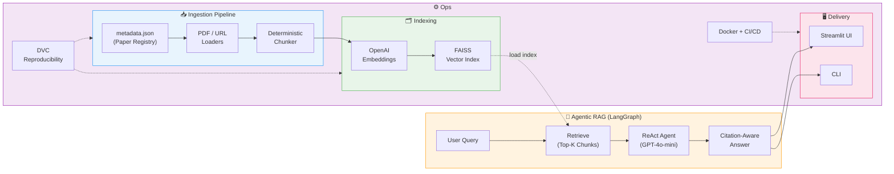

# ChildLanguageAcquisition-RAG

[](https://www.python.org/)
[](https://www.langchain.com/)
[](https://langchain-ai.github.io/langgraph/)
[](https://openai.com/)
[](https://github.com/facebookresearch/faiss)
[](https://streamlit.io/)
[](https://dvc.org/)
[](https://www.docker.com/)
[](https://docs.astral.sh/uv/)
[](https://docs.astral.sh/ruff/)
[](LICENSE)

A **metadata-first, agentic Retrieval-Augmented Generation (RAG)** system for **child language acquisition research**, built with **LangChain, LangGraph, FAISS, OpenAI, and Streamlit**.

The system enables researchers to query a curated corpus of academic papers (PDFs and web-based sources) and obtain **grounded, citation-aware answers** through an agentic retrieval and generation workflow.

All data processing steps — document ingestion, chunking, vector index construction, and index persistence — are tracked using **DVC (Data Version Control)**, ensuring **end-to-end reproducibility**.

The project also includes a **production-oriented CI/CD pipeline** (GitHub Actions + Jenkins/Docker), enabling automated builds, containerization, and deployment to **AWS EC2 via Amazon ECR**.


---

## How It Works



---

## Project Structure

```
ChildLanguageAcquisition-RAG/
├── src/
│   └── childlanguagenet/
│       ├── __init__.py
│       ├── cli.py                     # CLI entry points
│       ├── config/
│       │   └── settings.py            # Typed settings (.env support)
│       ├── ingestion/
│       │   ├── metadata_registry.py   # Schema validation
│       │   ├── loaders.py             # PDF + URL loaders
│       │   └── chunking.py            # Deterministic chunking
│       ├── embeddings/
│       │   └── embedder.py            # OpenAI / local embeddings
│       ├── vectorstore/
│       │   ├── faiss_store.py         # FAISS build / load / retrieve
│       │   └── persistence.py         # Chunks JSONL + manifest
│       ├── graph/
│       │   └── rag_graph.py           # LangGraph RAG pipeline
│       ├── citations/
│       │   └── cite.py                # Citation model + formatting
│       └── telemetry/
│           ├── logging.py             # Structured logging
│           └── metrics.py             # Counters + histograms
│
├── apps/
│   └── streamlit_app.py              # Streamlit UI
│
├── data/
│   ├── metadata.json                  # Paper registry
│   ├── pdf/                           # Local PDF corpus
│   └── index/faiss/                   # Persisted FAISS index
│
├── artifacts/                         # Reports, metrics, ingested texts
├── tests/                             # Pytest test suite
│
├── dvc.yaml                           # DVC pipeline stages
├── Dockerfile                         # Production Docker image
├── docker-compose.yml                 # Local dev + deployment
├── .github/workflows/ci.yml           # GitHub Actions CI
├── .jenkins/Jenkinsfile               # Jenkins CI/CD pipeline
├── pyproject.toml                     # Project metadata + entry points
├── uv.lock                            # Locked dependencies
└── README.md
```

---

## Usage

### For Researchers (end users)

If the app is already deployed (e.g., on AWS EC2), **no setup is required**:

1. Open the provided URL in your browser (e.g., `http://<server-ip>:8501`)
2. Type your research question and get citation-aware answers

No git clone, no API key, no index building — everything runs server-side.

---

### For Developers (local setup)

#### 1. Clone the repository

```bash
git clone https://github.com/<your-org>/ChildLanguageAcquisition-RAG.git
cd ChildLanguageAcquisition-RAG
```

#### 2. Install dependencies (uv recommended)

```bash
pip install uv
uv sync
source .venv/bin/activate
```

#### 3. Environment variables

```bash
cp .env.example .env
# Edit .env and set OPENAI_API_KEY=sk-...
```

#### 4. Build the FAISS index

```bash
childrag-index
```

> **Don't want to build the index yourself?** You have two options:
>
> 1. **Pull the pre-built index** — if a [DVC remote](https://dvc.org/doc/user-guide/data-management/remote-storage) is configured, just run:
>
>    ```bash
>    dvc pull
>    ```
>
>    This downloads the ready-to-use FAISS index. **No PDFs needed** — go straight to Step 5.
>
> 2. **Auto-build on first launch** — if no index is found, the Streamlit app automatically builds one from `data/pdf/` + `metadata.json` when you open it.
>
> In both cases, an `OPENAI_API_KEY` is still required in your `.env` (it's used at query time to embed your question and generate answers).

#### 5. Run the Streamlit app

```bash
childrag-serve
# or: streamlit run apps/streamlit_app.py
```

Open http://localhost:8501

---

### Who needs what?

| Scenario | Clone repo? | API key? | PDFs? | Build index? |
|---|---|---|---|---|
| **Researcher** using the deployed app | No | No (server-side) | No | No |
| **Developer** with `dvc pull` | Yes | Yes (`.env`) | No | No |
| **Developer** building from scratch | Yes | Yes (`.env`) | Yes | Yes |

---

## CLI Commands

| Command | Description |
|---------|-------------|
| `childrag --help` | Show available subcommands |
| `childrag-index` | Build/update FAISS index from metadata.json |
| `childrag-serve` | Launch Streamlit app |
| `childrag validate-metadata` | Validate metadata.json schema |
| `childrag ingest` | Ingest documents → chunked JSONL |
| `childrag build-index` | Build FAISS index from ingested chunks |

---

## DVC Pipeline

```bash
dvc repro
```

Stages: `validate_metadata` → `ingest` → `build_index`

---

## Docker

```bash
docker build -t childlanguagenet-rag .
docker run -p 8501:8501 -e OPENAI_API_KEY=sk-... childlanguagenet-rag
```

Or with docker-compose:

```bash
OPENAI_API_KEY=sk-... docker compose up
```

---

## Example Questions

- What are the main characteristics of infant-directed speech discussed across these papers?
- How does infant-directed speech differ from adult-directed speech?
- What experimental methods are used to study early language development?
- Which papers analyze prosodic or phonetic exaggeration in infant-directed speech?

---

## Tech Stack

- **LangChain** + **LangGraph** — RAG orchestration
- **FAISS** — vector similarity search
- **OpenAI** — embeddings + LLM
- **Streamlit** — interactive UI
- **DVC** — data/pipeline versioning
- **uv** — fast dependency management
- **Docker** — containerization
- **GitHub Actions** + **Jenkins** — CI/CD

---

## Acknowledgements

Developed at the **University of Oslo**
Department of Linguistics and Scandinavian Studies

---

## Contact

**Arun Prakash Singh**
University of Oslo
📧 a.p.singh@iln.uio.no

---

## License

See [LICENSE](LICENSE).
